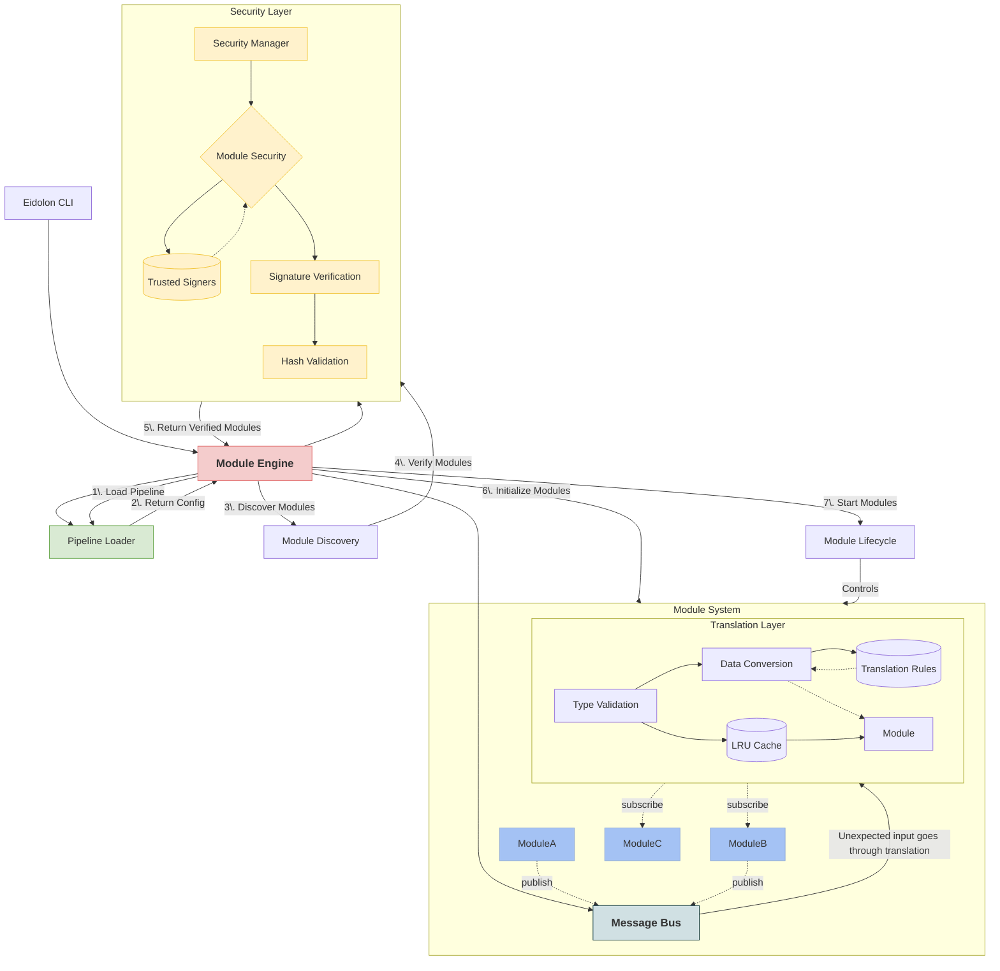

<a id="readme-top"></a>

<!-- PROJECT LOGO -->
<br />
<div align="center">
  <a href="https://github.com/lachlanharrisdev/PROJECT-EIDOLON">
    
  </a>

  <h1 align="center">PROJECT EIDOLON</h1>

  <p>
    Eidolon is a modular OSINT pipeline framework that makes information gathering feel like cheating — <b>because it almost is.</b>
    <br />
    <a href="https://lachlanharrisdev.github.io/PROJECT-EIDOLON/"><strong>Explore the docs »</strong></a>
    <br />
    <br />
    <a href="https://github.com/lachlanharrisdev/PROJECT-EIDOLON/issues">Issues</a>
    &middot;
    <a href="/.github/CONTRIBUTING.md">Contributing</a>
    &middot;
    <a href="/.github/SECURITY.md">Security</a>
    &middot;
    <a href="/LICENSE">License</a>
    &middot;
    <a href="/.github/CODE_OF_CONDUCT.md">Code of Conduct</a>
  </p>
</div>
<br/>
<!-- BADGES -->
<div align='center'>
    
[![Contributors][contributors-shield]][contributors-url]
[![Forks][forks-shield]][forks-url]
[![Stargazers][stars-shield]][stars-url]
[![Issues][issues-shield]][issues-url]

</div>
<br/>

## TABLE OF CONTENTS

</div>

* [Overview](#-overview)
* [Features](#-features)
* [How It Works](#-how-it-works)
* [Default Modules](#-default-modules)
* [Getting Started](#-getting-started)
    * [Requirements](#requirements)
    * [Installation](#installation)
    * [Docker](#docker)
* [Usage](#-usage)
* [Development & contributing](#-development--contributing)
    * [Modules](#modules)
    * [Testing](#testing)
 * [Mission](#-mission)

<br/>

# // OVERVIEW

**Imagine this.**

You plug in a single URL.

One command fires off a web scraper, a web crawler, a whois lookup, a passive vulnerability scanner, an outdated JS sniffer, and even an XSS probe — all dancing together in perfect sync, no spaghetti code, no awkward bash chains, no tears.

Sixty seconds later, a polished report lands in your hands like it came from a Hollywood hacking montage.

**That’s Eidolon.**

But don’t be fooled by the magic show. Under the hood is a modular, stateless message bus that orchestrates I/O between pluggable components — each one signed, validated, and hot-swappable. You can wrap anything into a module: a CLI tool, a Python function, a Docker container. Eidolon turns them all into actors in your own scriptable pipeline.

Build once, reuse everywhere. No more writing glue code. No more rewriting your entire workflow just because you found a cooler library.

Eidolon doesn’t just connect tools — it makes them **speak the same language.**

<br/>

# // FEATURES

## MODULAR

Every pipeline, every module & every command is configurable down to the core. Your `pipeline.yaml` file can store all of your perfect settings, but if you need to overwrite the maximum threads in the web crawler, you can do that with a single extra argument.

* Workflows are stored in reusable `.yaml` files, each containing execution configuration, per-module configuration, module I/O & more
* The CLI has a powerful array of commands & arguments to make every run feel special
* Every module is swappable & removable
* A sophisticated translation layer converts datatypes automatically, so everything **just works**
```python
eidolon run -s crawler.timeout=10 scryer.phones=false
```
```yaml
modules:
- name: aethon_crawler
  id: crawler
  config: [concurrency: 300, timeout: 8, verify_ssl: true]
  input: [urls: cleaner.cleaned_urls]
  output: [crawled_data: "crawled_data", crawled_count: "url_count"]

- name: scryer
  config: [phones: true, emails: true]
  input: [data: crawler.crawled_data]
```

<br/>

## SECURE

Anything that has the slightest chance of exposing your device you aren't told about.

* Every module is checked for verification before its name is even loaded
* Add or delete any trusted module authors to allow their verified modules
* Self-sign modules you create & share them with the world
* Many configurable arguments to automate module permission

```bash
2025-01-01 12:00:00,000 INFO     [module_security.py:317]     Module 'aethon_urllist' verified by John Doe (Project Eidolon Owner)
2025-01-01 12:00:00,000 INFO     [engine_core.py:274]         Module 'aethon_urllist' verification successful

⚠️  SECURITY WARNING: Module 'example_malicious_module' is unsigned
This module has not been verified by any trusted signer.
Running unverified modules can be a security risk.

Do you want to proceed with this module? (yes/no/always): n
2025-01-01 12:00:05,000 INFO     [module_security.py:290]     User declined to run untrusted module 'example_malicious_module'
2025-01-01 12:00:05,000 WARNING  [engine_core.py:277]         Module 'example_malicious_module' verification failed - will be excluded from execution
```

<br/>

## PERFORMANT

Modules have virtually no overhead, with an I/O system & translation layer so light you won't believe it exists.

* Modules have access to a shared threadpool & can create their own
* Modules run fully asynchronously from one-another
* As long as it can be called from python, your CPU-bound logic can be written in **any** language
* Default modules are designed with flexibility, extensive features & raw power in mind

<br/>

# // HOW IT WORKS


<br/>

<br/>
 
<br/>

# // DEFAULT MODULES

| Module | Description |
| --- | --- |
| Aethon | An ultra-high performance web crawler inspired by the architecture of [Photon](https://github.com/s0md3v/Photon). <br/> Comes with three modules: `Aethon_Crawler`, `Aethon_URLList` (parses various formats of URL Lists into List[str], w/ example link generation) & `Aethon_URLClean` (Filters out & cleans URL Lists, based on unnecessary URL extensions, file extensions, duplicates & more) |
| Scryer | An offline web-scraper that takes raw HTML data and searches for metadata, headers, URLs, phone numbers, emails & more |
| Osiris | A maximally-configurable data filter that takes in huge lists / dictionaries & rapidly translates the output |
| Hermes | An ultra-lightweight report generator that takes in any raw data and parses it to a (mostly) human-readable format |

<br/>

# // GETTING STARTED

## REQUIREMENTS
- Python 3.12\*
- *\[Optional\]* Docker CLI


\* *specifically tested on `3.12.10`. Other python versions may work but are untested. If you'd like to request full support for a version, please create a github issue, PR, or raise a ticket in [the discord](https://discord.gg/wDcxk4pCs5). Our current limit is GitHub actions minutes D:*

<br/>

## INSTALLATION

1. Clone the repo
```bash
git clone https://github.com/lachlanharrisdev/project-eidolon.git
```

2. Change directory
```
cd project-eidolon
```

> **NON-DEVELOPERS:** If you don't plan on modifying any source code, just only follow the step below:

3. Install the tool
```bash
pip install .
```

<br/>

> **DEVELOPERS / CONTRIBUTORS:** If you plan on modifying any code, then please continue from here

3. Install package + dependencies
```bash
pip install -r requirements.txt
pip install -e .
```

4. Setup a development environment (Highly recommended):
```bash
# Windows
python -m venv .venv
.venv\Scripts\activate

# Linux/macOS
python3 -m venv .venv
source .venv/bin/activate
```

<br/>

## DOCKER

> You can also pull from the [GitHub Container Registry](https://github.com/lachlanharrisdev/PROJECT-EIDOLON/packages) and download / install the desired docker container from there

1. Clone the repo
```bash
git clone https://github.com/lachlanharrisdev/project-eidolon.git
cd project-eidolon
```

2. Build the full Docker image

```bash
docker build -f .Dockerfile -t eidolon .
```

3. Run the container

```bash
docker run -it eidolon
```

<br/>

# // USAGE

```bash
╭─ Options ────────────────────────────────────────────────────────────────────────────╮
│ --help          Show this message and exit.                                          │
╰──────────────────────────────────────────────────────────────────────────────────────╯
╭─ Commands ───────────────────────────────────────────────────────────────────────────╮
│ run        Run the application with modules specified in the pipeline.               │
│ list       List available pipelines or modules, including descriptions and metadata. │
│ config     View or update a configuration setting.                                   │
│ validate   Run tests using pytest in the specified directory.                        │
│ version    Display the CLI version and check for updates.                            │
│ update     Update Eidolon to the latest version from the repository.                 │
│ security   Security-related commands for module verification and key management      │
╰──────────────────────────────────────────────────────────────────────────────────────╯
```

\* *Usage as of 23/04/2025, v0.6.0. For up-to-date usage and command-specific help, please install the tool and run* `eidolon --help`

<br/>

# // DEVELOPMENT && CONTRIBUTING

To see more about how to contribute, please refer to [contributing.md](/CONTRIBUTING.md). We welcome more than just developers - documentation writers, researchers / journalists, funders, bug hunters etc. Even just pointing out bugs or noting some features you'd like to see will immensely help

<br/>

## SUBMITTING MODULES

We're open to reviewing any modules for addition to this repository to come default with Eidolon, however they must be made to a high standard and by the guidelines outlined in [contributing.md](/CONTRIBUTING.md). No modules will be accepted into this repository if they are for a niche usecase, connect with other non-open-source tools, or they do not inherit the core values behind the project.

Note that modules can still be *verified*, they just cannot be verified as default modules. Please check the documentation to understand how to verify your modules.

If you believe your module is ready to become a default module, please open a pull request detailing everything about your module, and we will review it carefully.

For more information on module verification, please read [security.md](/.github/SECURITY.md), or check out the documentation

<br/>

## TESTING

This project uses `pytest` for testing. Major core functionality & every individual module uses tests to ensure code quality. All test files begin with the prefix `test_`, as per the [pytest documentation](https://docs.pytest.org/en/stable/getting-started.html).

To run all the tests in the project locally before creating a pull request, run the following in the project directory:

```
pytest
```

You can run all tests within a specific directory using:
```
pytest <dir>/

# e.g. Run all of the tests for loaded modules
pytest modules/
```

For more info, refer to the [pytest documentation](https://docs.pytest.org/en/stable/getting-started.html)

<br/>

# // MISSION

Eidolon aims to revolutionize the OSINT landscape. We don't belive that information gathering should be a boring, repetitive & mistake-prone task, it should be fast, dynamic & interesting. Eidolon aims to take out the monotony of intelligence-gathering, so you and your company can focus on real problem solving, analysis & the beauty of data.

<br />
<div align="center">
  <a href="https://github.com/lachlanharrisdev/PROJECT-EIDOLON">
    
  </a>

  <h1 align="center">PROJECT EIDOLON</h1>
    <a href="#readme-top"><strong>Back to top</strong></a>
    <br />
    <br />
    <a href="https://github.com/lachlanharrisdev/PROJECT-EIDOLON/issues">Issues</a>
    &middot;
    <a href="/.github/CONTRIBUTING.md">Contributing</a>
    &middot;
    <a href="/.github/SECURITY.md">Security</a>
    &middot;
    <a href="/LICENSE">License</a>
    &middot;
    <a href="/.github/CODE_OF_CONDUCT.md">Code of Conduct</a>
  </p>
</div>
<br/>


<!-- MARKDOWN LINKS & IMAGES -->
<!-- https://www.markdownguide.org/basic-syntax/#reference-style-links -->
[contributors-shield]: https://img.shields.io/github/contributors/lachlanharrisdev/PROJECT-EIDOLON.svg?style=for-the-badge
[contributors-url]: https://github.com/lachlanharrisdev/PROJECT-EIDOLON/graphs/contributors
[forks-shield]: https://img.shields.io/github/forks/lachlanharrisdev/PROJECT-EIDOLON.svg?style=for-the-badge
[forks-url]: https://github.com/lachlanharrisdev/PROJECT-EIDOLON/network/members
[stars-shield]: https://img.shields.io/github/stars/lachlanharrisdev/PROJECT-EIDOLON.svg?style=for-the-badge
[stars-url]: https://github.com/lachlanharrisdev/PROJECT-EIDOLON/stargazers
[issues-shield]: https://img.shields.io/github/issues/lachlanharrisdev/PROJECT-EIDOLON.svg?style=for-the-badge
[issues-url]: https://github.com/lachlanharrisdev/PROJECT-EIDOLON/issues
[license-shield]: https://img.shields.io/github/license/lachlanharrisdev/PROJECT-EIDOLON.svg?style=for-the-badge
[license-url]: https://github.com/lachlanharrisdev/PROJECT-EIDOLON/blob/master/LICENSE.txt

[issues]: https://github.com/lachlanharrisdev/PROJECT-EIDOLON/issues
[contributing]: /.github/CONTRIBUTING.md
[security]: /.github/SECURITY.md
[license]: /LICENSE
[code-of-conduct]: /.github/CODE_OF_CONDUCT.md
[product-screenshot]: images/screenshot.png

